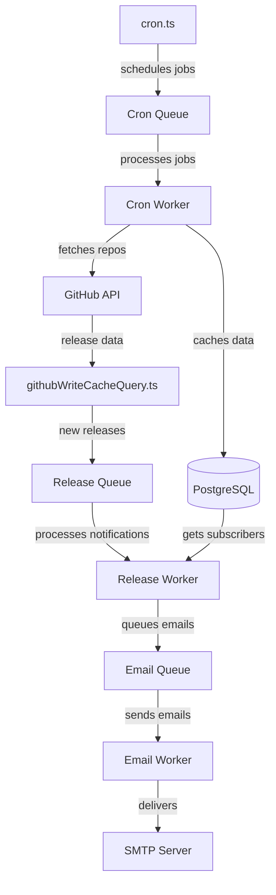

# GitHub Release Tracker Server

## Overview

This is the server component of the GitHub Release Tracker application, providing a GraphQL API with GitHub integration capabilities. The server handles authentication, database operations, and API interactions.

## Features

- **GraphQL API**: Modern API architecture using GraphQL Yoga
- **GitHub Integration**: OAuth authentication and repository data access
- **Database Integration**: PostgreSQL for persistent storage
- **Session Management**: Redis-based session storage
- **Security**: Helmet middleware implementation for Express
- **Background Job Processing**: BullMQ for reliable task execution
- **Release Notification**: PostgreSQL notification listener for real-time release updates

## Prerequisites

- Node.js (v16+)
- PostgreSQL
- Redis
- GitHub OAuth application credentials

## Setup

1. Install dependencies:
   ```
   pnpm install
   ```

2. Set up environment variables.

3. Initialize database:
   ```
   pnpm run migrate:local
   ```

4. Start development server:
   ```
   pnpm run dev
   ```

5. Start the release listener (in a separate terminal):
   ```
   pnpm run dev:listener
   ```

## Architecture

The server architecture consists of several interconnected layers:

### Express Layer
The Express layer serves as the HTTP server foundation, handling requests, middleware, security, and session management. It orchestrates the flow of requests to the GraphQL engine and authentication services.

```typescript
// Example from src/main.ts
const app = buildApp()
const yoga = buildYoga()
app.use(yoga.graphqlEndpoint, yoga)
```

### GraphQL Layer
The GraphQL layer provides a type-safe API interface. It leverages GraphQL Yoga to create a performant and developer-friendly GraphQL server that integrates with the Express application.

## GraphQL Code Generation

This server uses GraphQL Code Generator to create TypeScript types from the GraphQL schema. The workflow is:

1. Schema defined in `schema.graphql` at the project root
2. Running `pnpm generate` at the project root creates type definitions at `server/src/resolvers-types.ts`
3. These types are used throughout the codebase for type-safe resolvers

### Type-Safe Resolver Helpers

The server provides custom wrapper functions in `src/lib/yoga/yogaHelpers.ts` that leverage generated types:

```typescript
// Example of typed query resolver
export function query<K extends keyof QueryResolvers>(
  query: K, 
  cb: NonNullable<QueryResolvers[K]>
): QueryResolvers[K] {
  // implementation...
}
```

These helpers ensure type safety while also providing error handling and performance logging:

```typescript
// Example usage in listReleasesQuery.ts
export const listReleases = query(
  'listReleases',
  async (_, { repositoryUrl, includePrereleases, markViewed }, { user, pgClient }) => {
    // Implementation with full type safety
  }
)
```

This pattern is used throughout the codebase to ensure type-safe GraphQL operations.

### Authentication Layer
The authentication layer uses Passport.js with GitHub OAuth strategy to authenticate users, manage sessions, and provide secure access to the application's resources.

### Database Layer
The database layer manages connections to PostgreSQL, handles database schema setup, and provides transaction management for data consistency.

For the latest schema details, see [the database documentation](./database.md).

### GitHub Integration Layer
The GitHub integration layer facilitates interaction with GitHub's API and implements efficient caching strategies to optimize performance.

[See the README in src/lib/github](./src/lib/github)

### Queue System Architecture
The application uses BullMQ with Redis for background job processing. This system handles scheduled tasks, GitHub data fetching, and email notifications.



#### Queue Components:

1. **Cron Queue System**:
   - `cronQueue.ts`: Defines a BullMQ queue for scheduled jobs
   - `cronWorker.ts`: Processes scheduled jobs to check for new releases
   - Triggered by `cron.ts` on a configurable schedule (CRON_SCHEDULE env variable)
   - Fetches repositories in order of least recently checked
   - Handles GitHub rate limiting with exponential backoff

2. **Release Queue System**:
   - `releaseQueue.ts`: Manages notifications for new releases
   - `releaseWorker.ts`: Processes release notifications, finding subscribers and queueing emails
   - Triggered by `githubWriteCacheQuery.ts` when new releases are detected

3. **Email Queue System**:
   - `email.ts`: Defines queue and worker for email delivery
   - Provides reliable email sending with retries
   - Supports general emails and formatted release notifications

#### Queue Flow:

1. The cron scheduler (`cron.ts`) adds jobs to the Cron Queue at regular intervals
2. The Cron Worker processes these jobs by:
   - Fetching repositories that need checking
   - Using `GithubRepoCacheBuilder` to retrieve and cache GitHub data
   - Handling rate limits and failures gracefully

3. When `githubWriteCacheQuery.ts` detects new releases, it:
   - Saves release data to the database
   - Adds notification jobs to the Release Queue

4. The Release Worker processes these notifications by:
   - Finding users subscribed to the repository
   - Adding email jobs to the Email Queue for each subscriber

5. The Email Worker delivers notifications to users via configured SMTP server

This multi-queue architecture ensures reliability through job persistence, automatic retries, and concurrency management.

#### Queue Monitoring Dashboard

The application includes a web-based dashboard for monitoring queue status and jobs:

- **URL**: http://localhost:3000/admin/queues
- **Default Credentials**: 
  - Username: `admin`
  - Password: `password`

The dashboard provides visibility into all queue operations:
- View active, completed, failed, and delayed jobs
- Inspect job details and data
- Retry failed jobs
- Monitor queue performance

To access a specific queue directly:
- Cron Queue: http://localhost:3000/admin/queues/queue/cronJobs
- Release Queue: http://localhost:3000/admin/queues/queue/releaseNotifications
- Email Queue: http://localhost:3000/admin/queues/queue/emailQueue

### Release Notification Layer
The release notification layer listens for PostgreSQL notifications about new releases and processes them.

#### Two Implementation Options:

1. **Simple Listener (recommended)**:
   - A standalone process (src/listener.ts) that listens for PostgreSQL notifications
   - Simple and lightweight with no dependencies beyond the database
   - Designed to be run as a singleton process (configure your deployment to ensure only one instance runs)
   - Start with `pnpm run dev:listener`

2. **Worker with BullMQ**:
   - Uses Redis and BullMQ for job queue management (src/worker.ts)
   - Provides job locking and coordination across multiple processes
   - More complex but offers better failure recovery
   - Start with `pnpm run dev:worker`

## API Structure

The GraphQL API provides operations for:

- User authentication and profile management
- GitHub repository search and interaction
- Release tracking and filtering

For more information about the overall project setup, see the [root README](/).