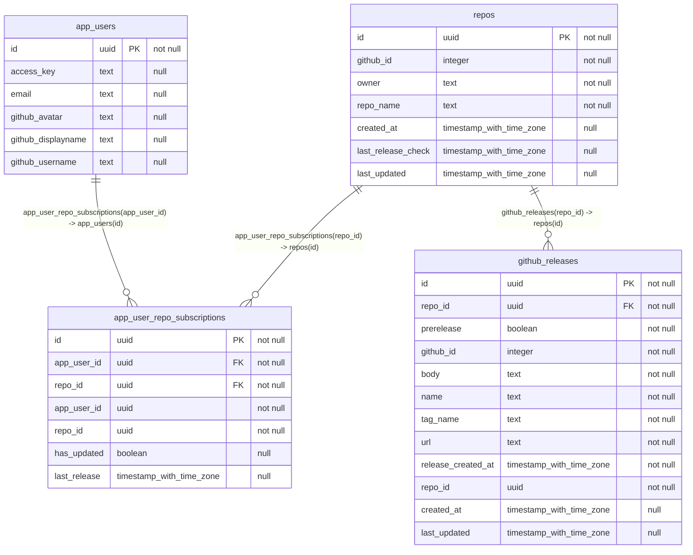

## Diagram

## Indexes

### `app_user_repo_subscriptions`

- `app_user_repo_subscriptions_pkey`
- `app_user_repo_subscriptions_unique_user_repo`

### `app_users`

- `app_users_github_username_key`
- `app_users_pkey`

### `github_releases`

- `github_releases_pkey`
- `github_releases_tag_repo_key`
- `idx_github_releases_repo_id`

### `repos`

- `idx_repos_owner_repo_name`
- `repos_github_id_key`
- `repos_pkey`
- `repos_unique_owner_repo`
